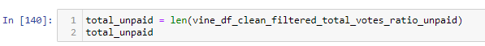
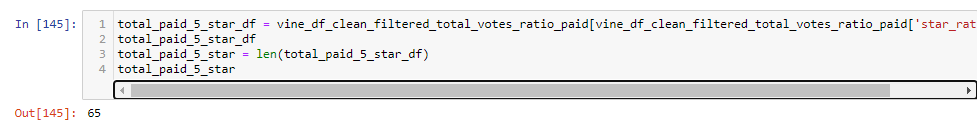
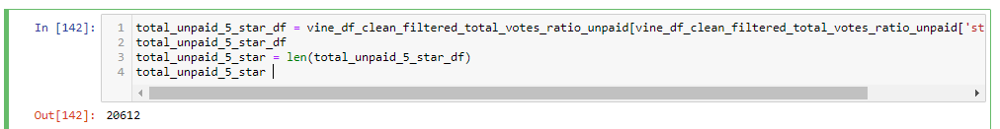
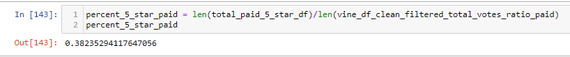

# Amazon_Vine_Analysis
Columbia Data Science Module 16

## Overview
For this project, I was instructed to conduct an analysis of product reviews from the Amazon Vine program - a program in which participants are paid to write reviews. In order to complete this project, I created an RDS on AWS. Then, using PySpark in Google Colab, I pushed the Amazon product review data to my local PostgreSQL database. Finally, I exported the dataframe as a .csv, read it into Jupyter Notebook, and used Pandas to conduct an analysis of the data. 

The question I answer in this project is: is the percentage of 5-star reviews higher from paid reviewers than unpaid reviewers? 

## Resources
Software/tools: PGAdmin 4, PySpark, AWS, Jupyter Notebook, Pandas

Data: The pet products Amazon review dataset, available [here](https://s3.amazonaws.com/amazon-reviews-pds/tsv/index.txt).

## Results
* **Vine reviews vs. non-Vine reviews**

I filtered the paid review dataset with the code below (I had previously cleaned the data set):

```
vine_df_clean_filtered_total_votes_ratio_unpaid = vine_df_clean_filtered_total_votes_ratio[vine_df_clean_filtered_total_votes_ratio['vine'] == False]
```
This yielded 170 paid Vine reviews for pet products. 


I ran another filter to create a data set with just unpaid reviews for pet products.
```
vine_df_clean_filtered_total_votes_ratio_unpaid = vine_df_clean_filtered_total_votes_ratio[vine_df_clean_filtered_total_votes_ratio['vine'] == False]
```

There are 37,840 unpaid reviews for pet products.



* **5-Star reviews in Vine vs. non-Vine**

I created a new dataframe that contained only 5-star paid Vine reviews. 
```
total_paid_5_star_df = vine_df_clean_filtered_total_votes_ratio_paid[vine_df_clean_filtered_total_votes_ratio_paid['star_rating'] == 5]
```



This left 65 out of 170 total paid reviews as 5-star. 

Next, I created a new dataframe containing only 5-star unpaid reviews.
```
total_unpaid_5_star_df = vine_df_clean_filtered_total_votes_ratio_unpaid[vine_df_clean_filtered_total_votes_ratio_unpaid['star_rating'] == 5]
```



* **Percentage of 5-star ratings in paid vs. unpaid reviews**

Finally, I calculated the percentage of paid reviews that were 5-star. 



Approximately 54.5% of paid reviews were 5-star. 

Then, I calculated the percentage of unpaid reviews that were 5-star.


