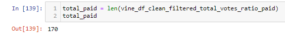
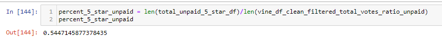

# Amazon_Vine_Analysis
Columbia Data Science Module 16

## Overview
For this project, I was instructed to conduct an analysis of product reviews from the Amazon Vine program - a program in which participants are paid to write reviews. In order to complete this project, I created an RDS on AWS. Then, using PySpark in Google Colab, I pushed the Amazon product review data to my local PostgreSQL database. Finally, I exported the dataframe as a .csv, read it into Jupyter Notebook, and used Pandas to conduct an analysis of the data. 

The question I answer in this project is: do paid reviewers give 5-star reviews at a higher rate than unpaid reviewers? 

### Resources
Software/tools: PGAdmin 4, AWS, Jupyter Notebook, Google Colab

Python packages: PySpark, pandas, numpy

Data: The pet products Amazon review dataset, available [here](https://s3.amazonaws.com/amazon-reviews-pds/tsv/index.txt).

## Analysis 

### Perform ETL on Amazon Product Reviews


## Results
* **Vine reviews vs. non-Vine reviews**

I filtered the paid review dataset with the code below (I had previously cleaned the data set):

```
vine_df_clean_filtered_total_votes_ratio_unpaid = vine_df_clean_filtered_total_votes_ratio[vine_df_clean_filtered_total_votes_ratio['vine'] == False]
```
This yielded 170 paid Vine reviews for pet products. 



I ran another filter to create a data set with just unpaid reviews for pet products.
```
vine_df_clean_filtered_total_votes_ratio_unpaid = vine_df_clean_filtered_total_votes_ratio[vine_df_clean_filtered_total_votes_ratio['vine'] == False]
```

There are 37,840 unpaid reviews for pet products.


* **5-Star reviews in Vine vs. non-Vine**

I created a new dataframe that contained only 5-star paid Vine reviews. 
```
total_paid_5_star_df = vine_df_clean_filtered_total_votes_ratio_paid[vine_df_clean_filtered_total_votes_ratio_paid['star_rating'] == 5]
```


This left 65 out of 170 total paid reviews as 5-star. 

Next, I created a new dataframe containing only 5-star unpaid reviews.
```
total_unpaid_5_star_df = vine_df_clean_filtered_total_votes_ratio_unpaid[vine_df_clean_filtered_total_votes_ratio_unpaid['star_rating'] == 5]
```


* **Percentage of 5-star ratings in paid vs. unpaid reviews**

Finally, I calculated the percentage of paid reviews that were 5-star. 


Approximately 38.2% of paid reviews were 5-star. 

Then, I calculated the percentage of unpaid reviews that were 5-star.



Roughly 54.5% of unpaid reviews were 5-star. 

## Summary

There is no evidence to suggest that paid Vine reviewers are biased positively toward pet products. In fact, they are significantly less positive toward products than their unpaid counterparts: just 38.2% of their reviews were 5-star, compared with 54.5% of the unpaid reviews. 

In order to confirm this, it would be helpful to do further analysis on the full dataset. Initially, the dataset contained well over 2.6 million reviews. However, I significantly winnowed this dataset down before doing my analysis. After filtering out reviews that didn't receive at least 20 votes and filtering out reviews that didn't have a positive vote ratio of at least 50%, only approximately 38,000 reviews remained. It's possible that this created selection bias: maybe users do not find 5-star reviews from paid reviewers trustworthy, so they do not vote for them. We would need to do analysis on the larger data set to make sure this analysis is not just a fluke of a highly curated dataset. 
